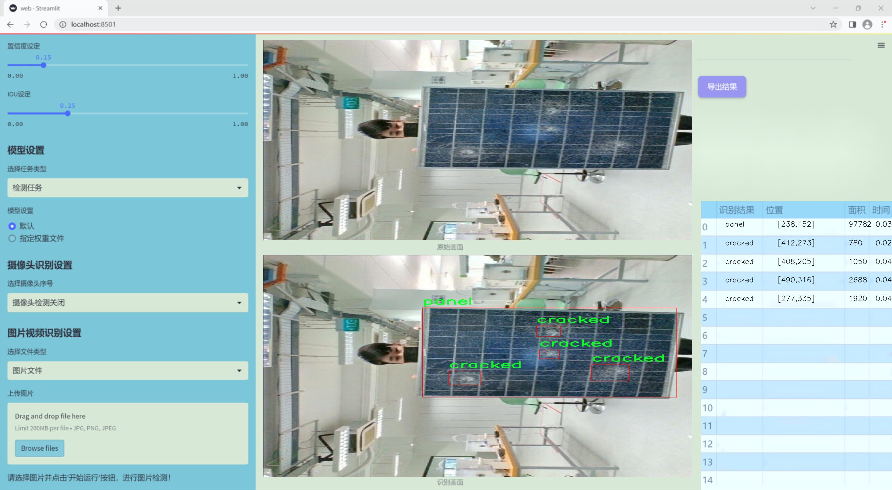
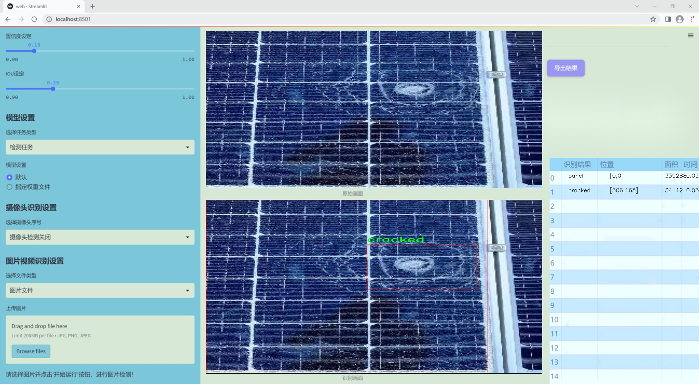
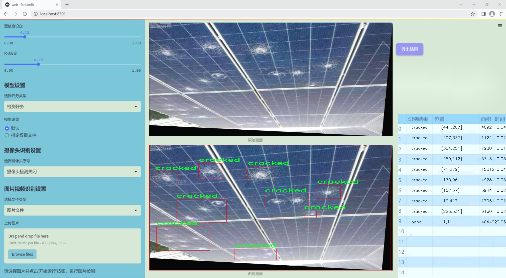
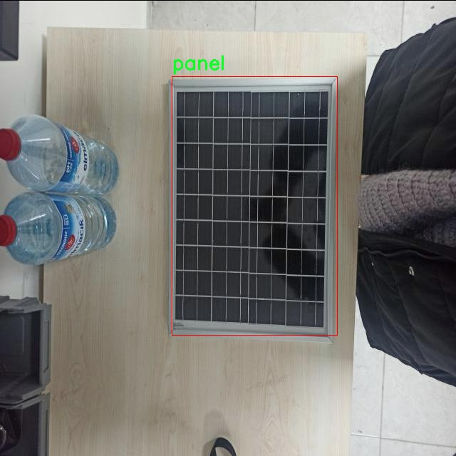
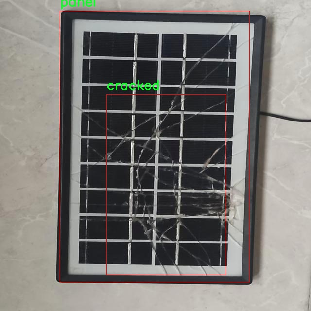
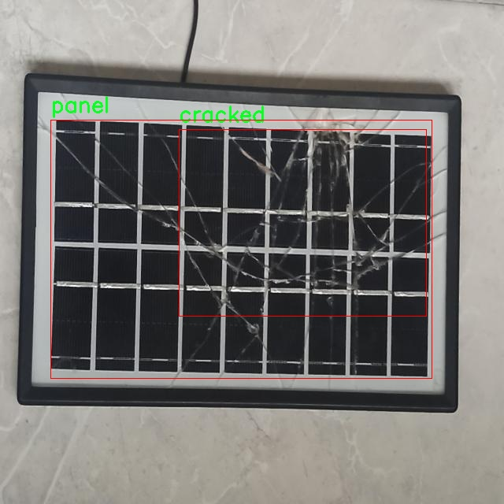
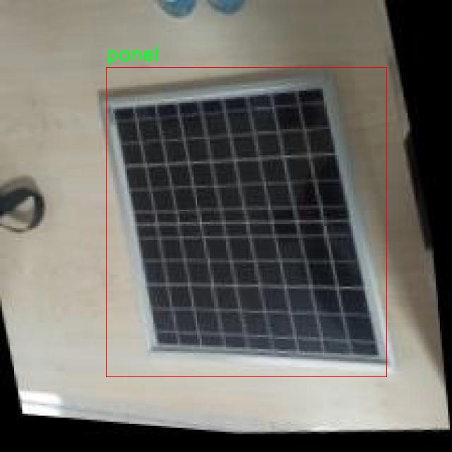
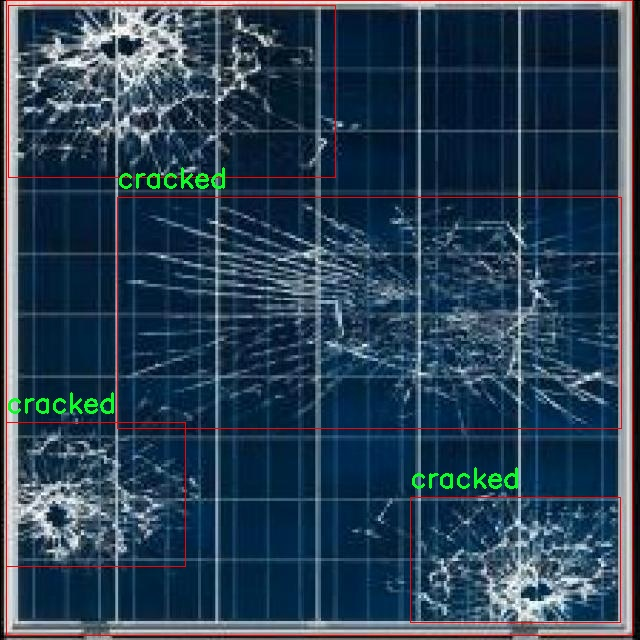

### 1.背景意义

研究背景与意义

随着全球对可再生能源的关注日益增强，光伏发电作为一种清洁且可持续的能源解决方案，得到了广泛应用。然而，光伏面板在长期使用过程中，可能会出现各种缺陷，如鸟粪污染、裂纹、灰尘积聚等，这些缺陷不仅影响光伏系统的发电效率，还可能导致设备的早期故障。因此，及时、准确地检测光伏面板的缺陷，成为保障光伏发电系统高效运行的重要环节。

传统的光伏面板缺陷检测方法多依赖人工巡检，这不仅耗时耗力，而且容易受到人为因素的影响，导致漏检或误检的情况。随着计算机视觉技术的快速发展，基于深度学习的自动化检测方法逐渐成为研究热点。YOLO（You Only Look Once）系列算法因其高效的实时检测能力，已被广泛应用于物体检测领域。特别是YOLOv11的改进版本，凭借其更高的检测精度和速度，能够在复杂环境中有效识别多种缺陷类型。

本研究基于改进YOLOv11算法，构建了一套光伏面板缺陷检测系统，利用一个包含6437张图像的综合数据集进行训练和测试。该数据集涵盖了四种主要缺陷类型：鸟粪、裂纹、灰尘和面板本身。通过对数据集的预处理和增强，系统能够在不同条件下保持较高的检测性能。研究的意义在于，不仅为光伏面板的维护提供了一种高效、智能的解决方案，还为未来在其他领域的缺陷检测应用提供了借鉴和参考。通过提升光伏面板的运行效率，推动可再生能源的普及和应用，助力全球能源转型与可持续发展目标的实现。

### 2.视频效果

[2.1 视频效果](https://www.bilibili.com/video/BV1YfB6YuEFe/)

### 3.图片效果







##### [项目涉及的源码数据来源链接](https://kdocs.cn/l/cszuIiCKVNis)**

注意：本项目提供训练的数据集和训练教程,由于版本持续更新,暂不提供权重文件（best.pt）,请按照6.训练教程进行训练后实现上图演示的效果。

### 4.数据集信息

##### 4.1 本项目数据集类别数＆类别名

nc: 4
names: ['bird_drop', 'cracked', 'dusty', 'panel']


该项目为【目标检测】数据集，请在【训练教程和Web端加载模型教程（第三步）】这一步的时候按照【目标检测】部分的教程来训练

##### 4.2 本项目数据集信息介绍

本项目数据集信息介绍

本项目所使用的数据集名为“Solar PV Maintenance Combined Dataset”，旨在为改进YOLOv11的光伏面板缺陷检测系统提供丰富的训练素材。该数据集包含四个主要类别，分别是“鸟粪”、“裂纹”、“灰尘”和“面板”，这些类别涵盖了光伏面板在实际应用中可能遇到的常见缺陷。通过对这些缺陷的有效识别与分类，系统能够实现更高效的光伏面板维护与管理，进而提升光伏发电的整体效率和可靠性。

在数据集的构建过程中，特别注重了样本的多样性与代表性。每个类别均包含大量的图像样本，确保系统在训练过程中能够学习到不同环境、光照条件下的特征。这种多样性不仅有助于提高模型的泛化能力，还能增强其在实际应用中的适应性。例如，鸟粪的样本涵盖了不同的污染程度和分布方式，而裂纹则展示了从微小裂纹到严重损坏的各种情况。灰尘的样本则包括了不同类型的灰尘覆盖，面板类别则提供了完整的光伏面板图像，以便于系统能够准确区分正常状态与缺陷状态。

此外，数据集的标注过程经过严格的审核，确保每个样本的标注准确无误。这一过程不仅提高了数据集的质量，也为后续的模型训练提供了坚实的基础。通过使用这一数据集，改进后的YOLOv11模型将能够在光伏面板缺陷检测任务中表现出色，为光伏产业的智能化维护提供有力支持。











### 5.全套项目环境部署视频教程（零基础手把手教学）

[5.1 所需软件PyCharm和Anaconda安装教程（第一步）](https://www.bilibili.com/video/BV1BoC1YCEKi/?spm_id_from=333.999.0.0&vd_source=bc9aec86d164b67a7004b996143742dc)


[5.2 安装Python虚拟环境创建和依赖库安装视频教程（第二步）](https://www.bilibili.com/video/BV1ZoC1YCEBw?spm_id_from=333.788.videopod.sections&vd_source=bc9aec86d164b67a7004b996143742dc)

### 6.改进YOLOv11训练教程和Web_UI前端加载模型教程（零基础手把手教学）

[6.1 改进YOLOv11训练教程和Web_UI前端加载模型教程（第三步）](https://www.bilibili.com/video/BV1BoC1YCEhR?spm_id_from=333.788.videopod.sections&vd_source=bc9aec86d164b67a7004b996143742dc)


按照上面的训练视频教程链接加载项目提供的数据集，运行train.py即可开始训练



     Epoch   gpu_mem       box       obj       cls    labels  img_size
     1/200     20.8G   0.01576   0.01955  0.007536        22      1280: 100%|██████████| 849/849 [14:42<00:00,  1.04s/it]
               Class     Images     Labels          P          R     mAP@.5 mAP@.5:.95: 100%|██████████| 213/213 [01:14<00:00,  2.87it/s]
                 all       3395      17314      0.994      0.957      0.0957      0.0843

     Epoch   gpu_mem       box       obj       cls    labels  img_size
     2/200     20.8G   0.01578   0.01923  0.007006        22      1280: 100%|██████████| 849/849 [14:44<00:00,  1.04s/it]
               Class     Images     Labels          P          R     mAP@.5 mAP@.5:.95: 100%|██████████| 213/213 [01:12<00:00,  2.95it/s]
                 all       3395      17314      0.996      0.956      0.0957      0.0845

     Epoch   gpu_mem       box       obj       cls    labels  img_size
     3/200     20.8G   0.01561    0.0191  0.006895        27      1280: 100%|██████████| 849/849 [10:56<00:00,  1.29it/s]
               Class     Images     Labels          P          R     mAP@.5 mAP@.5:.95: 100%|███████   | 187/213 [00:52<00:00,  4.04it/s]
                 all       3395      17314      0.996      0.957      0.0957      0.0845


###### [项目数据集下载链接](https://kdocs.cn/l/cszuIiCKVNis)

### 7.原始YOLOv11算法讲解

YOLO11采用改进的骨干和颈部架构，增强了特征提取能力，提高了物体检测的精确度和复杂任务的表现。YOLO11引入精炼的架构设计和优化的训练流程，实现更快的处理速度，同时保持精度和性能之间的最佳平衡。通过模型设计的进步，YOLO11m在COCO数据集上实现了更高的均值平均精度（mAP），同时使用比YOLOv8m少22%的参数，使其在不妥协准确性的情况下更加计算高效。YOLO11可以无缝部署在各种环境中，包括边缘设备、云平台以及支持NVIDIA
GPU的系统，确保最大灵活性。无论是物体检测、实例分割、图像分类、姿态估计，还是定向物体检测（OBB），YOLO11都旨在应对多样的计算机视觉挑战。


##### **Ultralytics YOLO11相比于之前版本的主要改进有哪些？**

Ultralytics YOLO11在其前身基础上引入了几项重要进步。主要改进包括：

  1. **增强的特征提取** ：YOLO11采用改进的骨干和颈部架构，增强了特征提取能力，提高了物体检测的精确度。
  2.  **优化的效率和速度** ：精炼的架构设计和优化的训练流程实现了更快的处理速度，同时保持了准确性和性能之间的平衡。
  3.  **更高的准确性与更少的参数** ：YOLO11m在COCO数据集上实现了更高的均值平均精度（mAP），同时使用比YOLOv8m少22%的参数，使其在不妥协准确性的情况下更加计算高效。
  4.  **环境适应性强** ：YOLO11可以在多种环境中部署，包括边缘设备、云平台以及支持NVIDIA GPU的系统。
  5.  **支持广泛的任务** ：YOLO11支持多种计算机视觉任务，如物体检测、实例分割、图像分类、姿态估计和定向物体检测（OBB）。

我们先来看一下其网络结构有什么变化，可以看出，相比较于YOLOv8模型，其将CF2模块改成C3K2，同时在SPPF模块后面添加了一个C2PSA模块，且将YOLOv10的head思想引入到YOLO11的head中，使用深度可分离的方法，减少冗余计算，提高效率。下面我们来详细看一下这两个模块的结构是怎么构成的，以及它们为什么要这样设计


##### C3K2的网络结构

从下面图中我们可以看到，C3K2模块其实就是C2F模块转变出来的，它代码中有一个设置，就是当c3k这个参数为FALSE的时候，C3K2模块就是C2F模块，也就是说它的Bottleneck是普通的Bottleneck；反之当它为true的时候，将Bottleneck模块替换成C3模块。


##### C2PSA的网络结构

` `C2PSA是对 `C2f` 模块的扩展，它结合了PSA(Pointwise Spatial
Attention)块，用于增强特征提取和注意力机制。通过在标准 `C2f` 模块中引入 PSA
块，C2PSA实现了更强大的注意力机制，从而提高了模型对重要特征的捕捉能力。


##### **C2f 模块回顾：**

**** C2f模块是一个更快的 CSP（Cross Stage Partial）瓶颈实现，它通过两个卷积层和多个 Bottleneck
块进行特征提取。相比传统的 CSPNet，C2f 优化了瓶颈层的结构，使得计算速度更快。在 C2f中，`cv1` 是第一个 1x1
卷积，用于减少通道数；`cv2` 是另一个 1x1 卷积，用于恢复输出通道数。而 `n` 是一个包含 Bottleneck 块的数量，用于提取特征。

##### **C2PSA 模块的增强** ：

**C2PSA** 扩展了 C2f，通过引入PSA( **Position-Sensitive Attention)**
，旨在通过多头注意力机制和前馈神经网络来增强特征提取能力。它可以选择性地添加残差结构（shortcut）以优化梯度传播和网络训练效果。同时，使用FFN
可以将输入特征映射到更高维的空间，捕获输入特征的复杂非线性关系，允许模型学习更丰富的特征表示。

##### head部分

YOLO11在head部分的cls分支上使用深度可分离卷积 ，具体代码如下，cv2边界框回归分支，cv3分类分支。

    
    
     self.cv2 = nn.ModuleList(
                nn.Sequential(Conv(x, c2, 3), Conv(c2, c2, 3), nn.Conv2d(c2, 4 * self.reg_max, 1)) for x in ch
            )
            self.cv3 = nn.ModuleList(
                nn.Sequential(
                    nn.Sequential(DWConv(x, x, 3), Conv(x, c3, 1)),
                    nn.Sequential(DWConv(c3, c3, 3), Conv(c3, c3, 1)),
                    nn.Conv2d(c3, self.nc, 1),
                )
                for x in ch
            )


### 8.200+种全套改进YOLOV11创新点原理讲解

#### 8.1 200+种全套改进YOLOV11创新点原理讲解大全

由于篇幅限制，每个创新点的具体原理讲解就不全部展开，具体见下列网址中的改进模块对应项目的技术原理博客网址【Blog】（创新点均为模块化搭建，原理适配YOLOv5~YOLOv11等各种版本）

[改进模块技术原理博客【Blog】网址链接](https://gitee.com/qunmasj/good)


#### 8.2 精选部分改进YOLOV11创新点原理讲解

###### 这里节选部分改进创新点展开原理讲解(完整的改进原理见上图和[改进模块技术原理博客链接](https://gitee.com/qunmasj/good)【如果此小节的图加载失败可以通过CSDN或者Github搜索该博客的标题访问原始博客，原始博客图片显示正常】


### D-LKA Attention简介
自2010年代中期以来，卷积神经网络（CNNs）已成为许多计算机视觉应用的首选技术。它们能够从原始数据中自动提取复杂的特征表示，无需手动进行特征工程，这引起了医学图像分析社区的极大兴趣。许多成功的CNN架构，如U-Net、全卷积网络、DeepLab或SegCaps（分割胶囊），已经被开发出来。这些架构在语义分割任务中取得了巨大成功，先前的最新方法已经被超越。

在计算机视觉研究中，不同尺度下的目标识别是一个关键问题。在CNN中，可检测目标的大小与相应网络层的感受野尺寸密切相关。如果一个目标扩展到超出这个感受野的边界，这可能会导致欠分割结果。相反，与目标实际大小相比使用过大的感受野可能会限制识别，因为背景信息可能会对预测产生不必要的影响。

解决这个问题的一个有希望的方法涉及在并行使用具有不同尺寸的多个Kernel，类似于Inception块的机制。然而，由于参数和计算要求的指数增长，将Kernel大小增加以容纳更大的目标在实践中受到限制。因此，出现了各种策略，包括金字塔池化技术和不同尺度的扩张卷积，以捕获多尺度的上下文信息。

另一个直观的概念涉及将多尺度图像金字塔或它们的相关特征表示直接纳入网络架构。然而，这种方法存在挑战，特别是在管理训练和推理时间方面的可行性方面存在挑战。在这个背景下，使用编码器-解码器网络，如U-Net，已被证明是有利的。这样的网络在较浅的层中编码外观和位置，而在更深的层中，通过神经元的更广泛的感受野捕获更高的语义信息和上下文信息。

一些方法将来自不同层的特征组合在一起，或者预测来自不同尺寸的层的特征以使用多尺度的信息。此外，出现了从不同尺度的层中预测特征的方法，有效地实现了跨多个尺度的见解整合。然而，大多数编码器-解码器结构面临一个挑战：它们经常无法在不同尺度之间保持一致的特征，并主要使用最后一个解码器层生成分割结果。

语义分割是一项任务，涉及根据预定义的标签集为图像中的每个像素预测语义类别。这项任务要求提取高级特征同时保留初始的空间分辨率。CNNs非常适合捕获局部细节和低级信息，尽管以忽略全局上下文为代价。视觉Transformer（ViT）架构已经成为解决处理全局信息的视觉任务的关键，包括语义分割，取得了显著的成功。

ViT的基础是注意力机制，它有助于在整个输入序列上聚合信息。这种能力使网络能够合并远程的上下文提示，超越了CNN的有限感受野尺寸。然而，这种策略通常会限制ViT有效建模局部信息的能力。这种局限可能会妨碍它们检测局部纹理的能力，这对于各种诊断和预测任务至关重要。这种缺乏局部表示可以归因于ViT模型处理图像的特定方式。

ViT模型将图像分成一系列Patch，并使用自注意力机制来模拟它们之间的依赖关系。这种方法可能不如CNN模型中的卷积操作对感受野内提取局部特征有效。ViT和CNN模型之间的这种图像处理方法的差异可能解释了CNN模型在局部特征提取方面表现出色的原因。

近年来，已经开发出创新性方法来解决Transformer模型内部局部纹理不足的问题。其中一种方法是通过互补方法将CNN和ViT特征结合起来，以结合它们的优势并减轻局部表示的不足。TransUNet是这种方法的早期示例，它在CNN的瓶颈中集成了Transformer层，以模拟局部和全局依赖关系。HiFormer提出了一种解决方案，将Swin Transformer模块和基于CNN的编码器结合起来，生成两个多尺度特征表示，通过Double-Level Fusion模块集成。UNETR使用基于Transformer的编码器和CNN解码器进行3D医学图像分割。CoTr和TransBTS通过Transformer在低分辨率阶段增强分割性能，将CNN编码器和解码器连接在一起。

增强局部特征表示的另一种策略是重新设计纯Transformer模型内部的自注意力机制。在这方面，Swin-Unet在U形结构中集成了一个具有线性计算复杂性的Swin Transformer块作为多尺度 Backbone 。MISSFormer采用高效Transformer来解决视觉Transformer中的参数问题，通过在输入块上进行不可逆的降采样操作。D-Former引入了一个纯Transformer的管道，具有双重注意模块，以分段的方式捕获细粒度的局部注意和与多元单元的交互。然而，仍然存在一些特定的限制，包括计算效率低下，如TransUNet模型所示，对CNN Backbone 的严重依赖，如HiFormer所观察到的，以及对多尺度信息的忽略。

此外，目前的分割架构通常采用逐层处理3D输入 volumetric 的方法，无意中忽视了相邻切片之间的潜在相关性。这一疏忽限制了对 volumetric 信息的全面利用，因此损害了定位精度和上下文集成。此外，必须认识到，医学领域的病变通常在形状上发生变形。因此，用于医学图像分析的任何学习算法都必须具备捕捉和理解这些变形的能力。与此同时，该算法应保持计算效率，以便处理3D volumetric数据。

为了解决上述提到的挑战，作者提出了一个解决方案，即可变形大卷积核注意力模块（Deformable LKA module），它是作者网络设计的基本构建模块。这个模块明确设计成在有效处理上下文信息的同时保留局部描述符。作者的架构在这两个方面的平衡增强了实现精确语义分割的能力。

值得注意的是，参考该博客引入了一种基于数据的感受野的动态适应，不同于传统卷积操作中的固定滤波器Mask。这种自适应方法使作者能够克服与静态方法相关的固有限制。这种创新方法还扩展到了D-LKA Net架构的2D和3D版本的开发。

在3D模型的情况下，D-LKA机制被量身定制以适应3D环境，从而实现在不同 volumetric 切片之间无缝信息交互。最后，作者的贡献通过其计算效率得到进一步强调。作者通过仅依靠D-LKA概念的设计来实现这一点，在各种分割基准上取得了显著的性能，确立了作者的方法作为一种新的SOTA方法。

在本节中，作者首先概述方法论。首先，作者回顾了由Guo等人引入的大卷积核注意力（Large Kernel Attention，LKA）的概念。然后，作者介绍了作者对可变形LKA模块的创新探索。在此基础上，作者介绍了用于分割任务的2D和3D网络架构。

大卷积核提供了与自注意力机制类似的感受野。可以通过使用深度卷积、深度可扩展卷积和卷积来构建大卷积核，从而减少了参数和计算量。构建输入维度为和通道数的卷积核的深度卷积和深度可扩展卷积的卷积核大小的方程如下：


具有卷积核大小和膨胀率。参数数量和浮点运算（FLOPs）的计算如下：


FLOPs的数量与输入图像的大小成线性增长。参数的数量随通道数和卷积核大小的增加而呈二次增长。然而，由于它们通常都很小，因此它们不是限制因素。

为了最小化对于固定卷积核大小K的参数数量，可以将方程3对于膨胀率的导数设定为零：


例如，当卷积核大小为时，结果是。将这些公式扩展到3D情况是直接的。对于大小为和通道数C的输入，3D情况下参数数量和FLOPs 的方程如下：


具有卷积核大小和膨胀。


利用大卷积核进行医学图像分割的概念通过引入可变形卷积得以扩展。可变形卷积可以通过整数偏移自由调整采样网格以进行自由变形。额外的卷积层从特征图中学习出变形，从而创建一个偏移场。基于特征本身学习变形会导致自适应卷积核。这种灵活的卷积核形状可以提高病变或器官变形的表示，从而增强了目标边界的定义。

负责计算偏移的卷积层遵循其相应卷积层的卷积核大小和膨胀。双线性插值用于计算不在图像网格上的偏移的像素值。如图2所示，D-LKA模块可以表示为：


其中输入特征由表示，。表示为注意力图，其中每个值表示相应特征的相对重要性。运算符  表示逐元素乘法运算。值得注意的是，LKA不同于传统的注意力方法，它不需要额外的规范化函数，如或。这些规范化函数往往忽视高频信息，从而降低了基于自注意力的方法的性能。

在该方法的2D版本中，卷积层被可变形卷积所替代，因为可变形卷积能够改善对具有不规则形状和大小的目标的捕捉能力。这些目标在医学图像数据中常常出现，因此这种增强尤为重要。

然而，将可变形LKA的概念扩展到3D领域会带来一定的挑战。主要的约束来自于需要用于生成偏移的额外卷积层。与2D情况不同，由于输入和输出通道的性质，这一层无法以深度可分的方式执行。在3D环境中，输入通道对应于特征，而输出通道扩展到，其中是卷积核的大小。大卷积核的复杂性导致沿第3D的通道数扩展，导致参数和FLOPs大幅增加。因此，针对3D情况采用了另一种替代方法。在现有的LKA框架中，深度卷积之后引入了一个单独的可变形卷积层。这种战略性的设计调整旨在减轻扩展到3D领域所带来的挑战。


2D网络的架构如图1所示。第一变种使用MaxViT作为编码器组件，用于高效特征提取，而第二变种则结合可变形LKA层进行更精细、卓越的分割。

在更正式的描述中，编码器生成4个分层输出表示。首先，卷积干扰将输入图像的维度减小到。随后，通过4个MaxViT块的4个阶段进行特征提取，每个阶段后跟随降采样层。随着过程进展到解码器，实施了4个阶段的D-LKA层，每个阶段包含2个D-LKA块。然后，应用Patch扩展层以实现分辨率上采样，同时减小通道维度。最后，线性层负责生成最终的输出。

2D D-LKA块的结构包括LayerNorm、可变形LKA和多层感知器（MLP）。积分残差连接确保了有效的特征传播，即使在更深层也是如此。这个安排可以用数学方式表示为：


其中输入特征，层归一化LN，可变形LKA注意力，深度卷积，线性层和GeLU激活函数。

3D网络架构如图1所示，采用编码器-解码器设计进行分层结构化。首先，一个Patch嵌入层将输入图像的维度从（）减小到（）。在编码器中，采用了3个D-LKA阶段的序列，每个阶段包含3个D-LKA块。在每个阶段之后，通过降采样步骤将空间分辨率减半，同时将通道维度加倍。中央瓶颈包括另一组2个D-LKA块。解码器结构与编码器相对称。

为了将特征分辨率加倍，同时减少通道数，使用转置卷积。每个解码器阶段都使用3个D-LKA块来促进远距离特征依赖性。最终的分割输出由一个卷积层产生，后面跟随一个卷积层以匹配特定类别的通道要求。

为了建立输入图像和分割输出之间的直接连接，使用卷积形成了一个跳跃连接。额外的跳跃连接根据简单的加法对来自其他阶段的特征进行融合。最终的分割图是通过和卷积层的组合产生的。

3D D-LKA块包括层归一化，后跟D-LKA注意力，应用了残差连接的部分。随后的部分采用了一个卷积层，后面跟随一个卷积层，两者都伴随着残差连接。这个整个过程可以总结如下：


带有输入特征 、层归一化 、可变形 LKA 、卷积层 和输出特征 的公式。是指一个前馈网络，包括2个卷积层和激活函数。

表7显示了普通卷积和构建卷积的参数数量比较。尽管标准卷积的参数数量在通道数较多时急剧增加，但分解卷积的参数总体较低，并且增长速度不那么快。

与分解卷积相比，可变形分解卷积增加了大量参数，但仍然明显小于标准卷积。可变形卷积的主要参数是由偏移网络创建的。在这里，作者假设可变形深度卷积的Kernel大小为（5,5），可变形深度空洞卷积的Kernel大小为（7,7）。这导致了21×21大小的大Kernel的最佳参数数量。更高效地生成偏移量的方法将大大减少参数数量。


值得注意的是，引入可变形LKA确实会增加模型的参数数量和每秒的浮点运算次数（FLOPS）。然而，重要的是强调，这增加的计算负载不会影响作者模型的整体推理速度。

相反，对于Batch-size > 1，作者甚至观察到推理时间的减少，如图7所示。例如，基于作者的广泛实验，作者观察到对于Batch-size为16，具有可变形卷积和没有可变形卷积的推理时间分别为8.01毫秒和17.38毫秒。作者认为这是由于在2D中对可变形卷积的高效实现所致。为了测量时间，使用了大小为（）的随机输入。在GPU热身周期50次迭代之后，网络被推断了1000次。测量是在NVIDIA RTX 3090 GPU上进行的。


为了充分利用性能与参数之间的权衡关系，作者在图8中可视化了在Synapse 2D数据集上报告的DSC和HD性能以及基于参数数量的内存消耗。D-LKA Net引入了相当多的参数，约为101M。这比性能第二好的方法ScaleFormer使用的111.6M参数要少。

与更轻量级的DAEFormer模型相比，作者实现了更好的性能，这证明了参数增加的合理性。大多数参数来自于MaxViT编码器；因此，将编码器替换为更高效的编码器可以减少模型参数。值得注意的是，在此可视化中，作者最初将HD和内存值都归一化到[0, 100]范围内。随后，作者将它们从100缩小，以增强更高值的表示。


### 9.系统功能展示

图9.1.系统支持检测结果表格显示

  图9.2.系统支持置信度和IOU阈值手动调节

  图9.3.系统支持自定义加载权重文件best.pt(需要你通过步骤5中训练获得)

  图9.4.系统支持摄像头实时识别

  图9.5.系统支持图片识别

  图9.6.系统支持视频识别

  图9.7.系统支持识别结果文件自动保存

  图9.8.系统支持Excel导出检测结果数据


### 10. YOLOv11核心改进源码讲解

#### 10.1 starnet.py

以下是对代码中最核心部分的提取和详细注释。主要保留了StarNet模型的实现以及Block和ConvBN类的定义。

```python
import torch
import torch.nn as nn
from timm.models.layers import DropPath, trunc_normal_

class ConvBN(torch.nn.Sequential):
    """
    定义一个卷积层后接批归一化层的组合。
    """
    def __init__(self, in_planes, out_planes, kernel_size=1, stride=1, padding=0, dilation=1, groups=1, with_bn=True):
        super().__init__()
        # 添加卷积层
        self.add_module('conv', torch.nn.Conv2d(in_planes, out_planes, kernel_size, stride, padding, dilation, groups))
        if with_bn:
            # 如果需要，添加批归一化层
            self.add_module('bn', torch.nn.BatchNorm2d(out_planes))
            # 初始化批归一化层的权重和偏置
            torch.nn.init.constant_(self.bn.weight, 1)
            torch.nn.init.constant_(self.bn.bias, 0)

class Block(nn.Module):
    """
    StarNet中的基本构建块，包含深度可分离卷积和MLP结构。
    """
    def __init__(self, dim, mlp_ratio=3, drop_path=0.):
        super().__init__()
        # 深度可分离卷积
        self.dwconv = ConvBN(dim, dim, 7, 1, (7 - 1) // 2, groups=dim, with_bn=True)
        # MLP的两个线性变换
        self.f1 = ConvBN(dim, mlp_ratio * dim, 1, with_bn=False)
        self.f2 = ConvBN(dim, mlp_ratio * dim, 1, with_bn=False)
        # MLP的输出层
        self.g = ConvBN(mlp_ratio * dim, dim, 1, with_bn=True)
        # 第二个深度可分离卷积
        self.dwconv2 = ConvBN(dim, dim, 7, 1, (7 - 1) // 2, groups=dim, with_bn=False)
        self.act = nn.ReLU6()  # 激活函数
        self.drop_path = DropPath(drop_path) if drop_path > 0. else nn.Identity()  # 随机深度

    def forward(self, x):
        input = x  # 保存输入
        x = self.dwconv(x)  # 经过深度可分离卷积
        x1, x2 = self.f1(x), self.f2(x)  # 经过两个线性变换
        x = self.act(x1) * x2  # 元素级乘法
        x = self.dwconv2(self.g(x))  # 经过第二个深度可分离卷积
        x = input + self.drop_path(x)  # 残差连接
        return x

class StarNet(nn.Module):
    """
    StarNet模型的实现，包含多个Block和一个stem层。
    """
    def __init__(self, base_dim=32, depths=[3, 3, 12, 5], mlp_ratio=4, drop_path_rate=0.0, num_classes=1000, **kwargs):
        super().__init__()
        self.num_classes = num_classes
        self.in_channel = 32
        # stem层，初始卷积
        self.stem = nn.Sequential(ConvBN(3, self.in_channel, kernel_size=3, stride=2, padding=1), nn.ReLU6())
        dpr = [x.item() for x in torch.linspace(0, drop_path_rate, sum(depths))]  # 随机深度
        # 构建各个阶段
        self.stages = nn.ModuleList()
        cur = 0
        for i_layer in range(len(depths)):
            embed_dim = base_dim * 2 ** i_layer  # 当前阶段的嵌入维度
            down_sampler = ConvBN(self.in_channel, embed_dim, 3, 2, 1)  # 下采样层
            self.in_channel = embed_dim
            blocks = [Block(self.in_channel, mlp_ratio, dpr[cur + i]) for i in range(depths[i_layer])]  # 当前阶段的Block
            cur += depths[i_layer]
            self.stages.append(nn.Sequential(down_sampler, *blocks))  # 将下采样层和Block组合成一个阶段
        
        self.apply(self._init_weights)  # 初始化权重

    def _init_weights(self, m):
        """
        权重初始化函数。
        """
        if isinstance(m, (nn.Linear, nn.Conv2d)):
            trunc_normal_(m.weight, std=.02)  # 使用截断正态分布初始化权重
            if isinstance(m, nn.Linear) and m.bias is not None:
                nn.init.constant_(m.bias, 0)  # 初始化偏置为0
        elif isinstance(m, (nn.LayerNorm, nn.BatchNorm2d)):
            nn.init.constant_(m.bias, 0)  # 初始化偏置为0
            nn.init.constant_(m.weight, 1.0)  # 初始化权重为1.0

    def forward(self, x):
        """
        前向传播函数，返回各个阶段的特征。
        """
        features = []
        x = self.stem(x)  # 经过stem层
        features.append(x)  # 保存特征
        for stage in self.stages:
            x = stage(x)  # 经过每个阶段
            features.append(x)  # 保存特征
        return features  # 返回所有阶段的特征
```

### 代码核心部分说明：
1. **ConvBN类**：定义了一个卷积层后接批归一化层的组合，方便构建网络。
2. **Block类**：实现了StarNet的基本构建块，包含深度可分离卷积和MLP结构，使用元素级乘法作为关键操作。
3. **StarNet类**：整体网络结构，包含多个Block和下采样层，支持随机深度和特征提取。

以上是对StarNet模型的核心实现及其关键部分的详细注释。

该文件实现了一个名为StarNet的神经网络模型，主要用于深度学习任务。文件开头的文档字符串说明了该模型的设计理念，强调了其简洁性，以便突出元素级乘法的关键贡献。设计中没有使用层缩放（layer-scale）和训练期间的指数移动平均（EMA），这些通常会进一步提高性能。

文件导入了PyTorch库和一些相关模块，接着定义了一个包含多个模型的列表。`model_urls`字典中存储了不同版本StarNet模型的预训练权重的下载链接。

接下来定义了一个`ConvBN`类，该类继承自`torch.nn.Sequential`，用于构建卷积层和批归一化层。构造函数中根据输入参数初始化卷积层，并可选择性地添加批归一化层。

`Block`类是StarNet的基本构建块，包含多个卷积层和一个ReLU6激活函数。该类的构造函数中定义了深度可分离卷积、全连接层以及通过元素级乘法进行特征融合的操作。`forward`方法实现了数据的前向传播过程。

`StarNet`类是整个网络的核心，包含多个阶段（stages），每个阶段由一个下采样层和多个`Block`组成。构造函数中定义了网络的基础维度、每个阶段的深度、MLP比率、随机深度率等参数，并通过循环构建各个阶段。`_init_weights`方法用于初始化网络权重。

`forward`方法负责将输入数据通过网络的各个部分，并收集每个阶段的特征。

文件中还定义了多个函数（如`starnet_s1`、`starnet_s2`等），用于创建不同配置的StarNet模型，并可选择性地加载预训练权重。这些函数通过传递不同的参数来调整网络的结构和复杂度。

最后，文件还提供了几个非常小的网络版本（如`starnet_s050`、`starnet_s100`、`starnet_s150`），以适应不同的应用场景和计算资源限制。整体来看，该文件展示了StarNet模型的结构和功能，适合用于图像分类等任务。

#### 10.2 deconv.py

以下是代码中最核心的部分，并附上详细的中文注释：

```python
import math
import torch
from torch import nn
from einops.layers.torch import Rearrange

# 定义一个自定义的二维卷积层，带有特殊的权重处理
class Conv2d_cd(nn.Module):
    def __init__(self, in_channels, out_channels, kernel_size=3, stride=1,
                 padding=1, dilation=1, groups=1, bias=False, theta=1.0):
        super(Conv2d_cd, self).__init__() 
        # 初始化标准的卷积层
        self.conv = nn.Conv2d(in_channels, out_channels, kernel_size=kernel_size, stride=stride, padding=padding, dilation=dilation, groups=groups, bias=bias)
        self.theta = theta  # 用于后续权重调整的参数
    
    def get_weight(self):
        # 获取卷积层的权重
        conv_weight = self.conv.weight
        conv_shape = conv_weight.shape  # 获取权重的形状
        # 将权重重排为 (输入通道数, 输出通道数, 卷积核大小)
        conv_weight = Rearrange('c_in c_out k1 k2 -> c_in c_out (k1 k2)')(conv_weight)
        
        # 创建一个新的权重张量，初始化为0
        conv_weight_cd = torch.zeros(conv_shape[0], conv_shape[1], 3 * 3, device=conv_weight.device, dtype=conv_weight.dtype)
        # 将原始权重复制到新的权重张量
        conv_weight_cd[:, :, :] = conv_weight[:, :, :]
        # 调整权重，使得中心权重等于周围权重的和
        conv_weight_cd[:, :, 4] = conv_weight[:, :, 4] - conv_weight[:, :, :].sum(2)
        # 重排回原来的形状
        conv_weight_cd = Rearrange('c_in c_out (k1 k2) -> c_in c_out k1 k2', k1=conv_shape[2], k2=conv_shape[3])(conv_weight_cd)
        return conv_weight_cd, self.conv.bias  # 返回调整后的权重和偏置


# 定义一个自定义的卷积层，具有不同的权重调整方式
class DEConv(nn.Module):
    def __init__(self, dim):
        super(DEConv, self).__init__()
        # 初始化多个不同类型的卷积层
        self.conv1_1 = Conv2d_cd(dim, dim, 3, bias=True)
        self.conv1_2 = Conv2d_hd(dim, dim, 3, bias=True)
        self.conv1_3 = Conv2d_vd(dim, dim, 3, bias=True)
        self.conv1_4 = Conv2d_ad(dim, dim, 3, bias=True)
        self.conv1_5 = nn.Conv2d(dim, dim, 3, padding=1, bias=True)
        
        self.bn = nn.BatchNorm2d(dim)  # 批归一化层
        self.act = nn.ReLU()  # 激活函数

    def forward(self, x):
        # 前向传播
        if hasattr(self, 'conv1_1'):
            # 获取所有卷积层的权重和偏置
            w1, b1 = self.conv1_1.get_weight()
            w2, b2 = self.conv1_2.get_weight()
            w3, b3 = self.conv1_3.get_weight()
            w4, b4 = self.conv1_4.get_weight()
            w5, b5 = self.conv1_5.weight, self.conv1_5.bias

            # 将所有权重和偏置相加
            w = w1 + w2 + w3 + w4 + w5
            b = b1 + b2 + b3 + b4 + b5
            # 使用合并后的权重和偏置进行卷积操作
            res = nn.functional.conv2d(input=x, weight=w, bias=b, stride=1, padding=1, groups=1)
        else:
            res = self.conv1_5(x)  # 如果没有特殊卷积层，直接使用最后一个卷积层
        
        if hasattr(self, 'bn'):
            res = self.bn(res)  # 应用批归一化
        
        return self.act(res)  # 返回经过激活函数处理的结果
    
    def switch_to_deploy(self):
        # 切换到部署模式，合并权重和偏置
        w1, b1 = self.conv1_1.get_weight()
        w2, b2 = self.conv1_2.get_weight()
        w3, b3 = self.conv1_3.get_weight()
        w4, b4 = self.conv1_4.get_weight()
        w5, b5 = self.conv1_5.weight, self.conv1_5.bias

        # 合并权重和偏置
        self.conv1_5.weight = torch.nn.Parameter(w1 + w2 + w3 + w4 + w5)
        self.conv1_5.bias = torch.nn.Parameter(b1 + b2 + b3 + b4 + b5)
        
        # 删除不再需要的卷积层
        del self.conv1_1
        del self.conv1_2
        del self.conv1_3
        del self.conv1_4
```

### 代码核心部分说明：
1. **卷积层定义**：`Conv2d_cd` 类定义了一个自定义的卷积层，包含权重的特殊处理。`get_weight` 方法用于获取调整后的权重。
2. **DEConv 类**：`DEConv` 类将多个卷积层组合在一起，并在前向传播中对输入进行处理。它支持在训练和部署阶段之间切换，合并权重以提高推理效率。
3. **前向传播**：在 `forward` 方法中，所有卷积层的权重和偏置被合并，执行卷积操作，并通过批归一化和激活函数处理结果。
4. **切换到部署模式**：`switch_to_deploy` 方法合并所有卷积层的权重和偏置，优化模型以便于部署。

这些部分构成了整个模型的核心逻辑，确保了卷积操作的灵活性和效率。

这个程序文件 `deconv.py` 实现了一个深度学习模型中的反卷积（Deconvolution）模块，主要用于图像处理任务。代码中定义了多个卷积层的变体，分别实现了不同的卷积操作，并通过组合这些卷积层来构建一个更复杂的模型 `DEConv`。

首先，文件导入了必要的库，包括 `math`、`torch` 和 `torch.nn`，以及一些其他的工具类。接着，定义了多个卷积类，每个类都继承自 `nn.Module`，这些类分别是 `Conv2d_cd`、`Conv2d_ad`、`Conv2d_rd`、`Conv2d_hd` 和 `Conv2d_vd`。每个类的构造函数中都初始化了一个标准的二维卷积层 `nn.Conv2d`，并且可以通过参数设置卷积的输入输出通道、卷积核大小、步幅、填充等属性。

每个卷积类都有一个 `get_weight` 方法，用于获取卷积层的权重并进行一些变换。例如，`Conv2d_cd` 类通过重排权重的形状并对其进行调整，生成一个新的权重矩阵。`Conv2d_ad` 类则在此基础上对权重进行了加权调整。`Conv2d_rd` 类实现了一个前向传播方法，能够根据 `theta` 参数的值选择不同的卷积操作。

`DEConv` 类是整个模型的核心，包含了多个自定义卷积层的实例。它的构造函数中初始化了五个卷积层，并且使用了批归一化和激活函数。`forward` 方法实现了模型的前向传播逻辑，将输入数据通过所有卷积层进行处理，并在最后应用批归一化和激活函数。

此外，`DEConv` 类还实现了一个 `switch_to_deploy` 方法，用于在模型部署时将多个卷积层的权重合并为一个卷积层，以提高推理效率。在这个方法中，所有卷积层的权重和偏置被合并，并且删除了不再需要的卷积层。

最后，文件的主程序部分创建了一个随机输入数据，实例化了 `DEConv` 模型，并进行了前向传播测试。模型的输出在调用 `switch_to_deploy` 方法前后进行比较，以验证合并后的模型是否仍然能够产生相同的输出。

整体来看，这个文件展示了如何通过自定义卷积层和组合不同的卷积操作来构建一个复杂的深度学习模型，并且提供了在训练和部署阶段的灵活性。

#### 10.3 mamba_vss.py

以下是保留的核心代码部分，并添加了详细的中文注释：

```python
import torch
import torch.nn as nn
import torch.nn.functional as F

class SS2D(nn.Module):
    def __init__(self, d_model, d_state=16, d_conv=3, expand=2, dropout=0.):
        super().__init__()
        self.d_model = d_model  # 输入特征的维度
        self.d_state = d_state  # 状态的维度
        self.d_conv = d_conv  # 卷积核的大小
        self.expand = expand  # 扩展因子
        self.d_inner = int(self.expand * self.d_model)  # 内部特征维度
        
        # 输入线性变换，将输入特征维度映射到内部特征维度
        self.in_proj = nn.Linear(self.d_model, self.d_inner * 2)
        
        # 2D卷积层，使用深度可分离卷积
        self.conv2d = nn.Conv2d(
            in_channels=self.d_inner,
            out_channels=self.d_inner,
            groups=self.d_inner,
            kernel_size=d_conv,
            padding=(d_conv - 1) // 2,
        )
        
        self.act = nn.SiLU()  # 激活函数

        # 状态的线性变换
        self.x_proj_weight = nn.Parameter(torch.randn(4, self.d_inner, self.d_state * 2))  # 权重
        self.dt_projs_weight = nn.Parameter(torch.randn(4, self.d_inner, self.d_state))  # dt投影权重
        self.dt_projs_bias = nn.Parameter(torch.randn(4, self.d_inner))  # dt投影偏置
        
        # 初始化A和D参数
        self.A_logs = self.A_log_init(self.d_state, self.d_inner)  # A参数
        self.Ds = self.D_init(self.d_inner)  # D参数
        
        self.out_norm = nn.LayerNorm(self.d_inner)  # 输出归一化层
        self.out_proj = nn.Linear(self.d_inner, self.d_model)  # 输出线性变换
        self.dropout = nn.Dropout(dropout) if dropout > 0. else None  # Dropout层

    @staticmethod
    def A_log_init(d_state, d_inner):
        # 初始化A参数
        A = torch.arange(1, d_state + 1, dtype=torch.float32)
        A_log = torch.log(A).repeat(4, 1, 1)  # 复制4次
        return nn.Parameter(A_log)

    @staticmethod
    def D_init(d_inner):
        # 初始化D参数
        D = torch.ones(d_inner)
        return nn.Parameter(D)

    def forward_core(self, x: torch.Tensor):
        # 核心前向计算
        B, C, H, W = x.shape
        L = H * W  # 计算序列长度

        # 线性变换和卷积
        x_dbl = torch.einsum("b c h w -> b c (h w)", x)  # 展平
        x_dbl = self.in_proj(x_dbl)  # 输入投影

        # 计算dts, Bs, Cs
        dts, Bs, Cs = torch.split(x_dbl, [self.d_state, self.d_state, self.d_state], dim=1)

        # 计算输出
        out_y = self.selective_scan(x, dts, Bs, Cs, self.Ds)
        y = self.out_norm(out_y)  # 归一化
        return self.out_proj(y)  # 输出投影

    def forward(self, x: torch.Tensor):
        # 前向传播
        x = self.in_proj(x)  # 输入投影
        x = x.permute(0, 2, 3, 1)  # 调整维度
        x = self.act(self.conv2d(x))  # 卷积和激活
        y = self.forward_core(x)  # 核心计算
        if self.dropout is not None:
            y = self.dropout(y)  # 应用Dropout
        return y

class VSSBlock(nn.Module):
    def __init__(self, hidden_dim: int = 0, drop_path: float = 0.2):
        super().__init__()
        self.ln_1 = nn.LayerNorm(hidden_dim)  # 归一化层
        self.self_attention = SS2D(d_model=hidden_dim)  # 自注意力层
        self.drop_path = nn.Dropout(drop_path)  # DropPath层

    def forward(self, input: torch.Tensor):
        # 前向传播
        input = input.permute((0, 2, 3, 1))  # 调整维度
        x = input + self.drop_path(self.self_attention(self.ln_1(input)))  # 残差连接
        return x.permute((0, 3, 1, 2))  # 调整维度回去

# 示例代码
if __name__ == '__main__':
    inputs = torch.randn((1, 64, 32, 32)).cuda()  # 输入数据
    model = VSSBlock(64).cuda()  # 实例化模型
    pred = model(inputs)  # 前向传播
    print(pred.size())  # 输出预测结果的尺寸
```

### 代码说明：
1. **SS2D类**：实现了一个自注意力机制的模块，包含输入投影、卷积层、状态线性变换等。
2. **VSSBlock类**：封装了SS2D模块，并添加了归一化和DropPath机制。
3. **前向传播**：在`forward`方法中实现了输入的处理、注意力计算和输出的生成。

该代码实现了一个基于自注意力机制的神经网络模块，适用于各种深度学习任务。

这个程序文件 `mamba_vss.py` 实现了一个深度学习模型的两个主要模块：`VSSBlock` 和 `Mamba2Block`，它们都是基于 PyTorch 框架构建的。文件中包含了一些重要的类和方法，主要用于构建和训练神经网络，特别是在处理时序数据或图像数据时。

首先，文件导入了必要的库，包括 PyTorch、数学库、以及一些用于张量操作的库。接着，定义了一个名为 `SS2D` 的类，这是一个核心模块，主要用于实现某种形式的自注意力机制。这个类的构造函数接收多个参数，例如模型维度、状态维度、卷积核大小等，并根据这些参数初始化网络的各个层。

在 `SS2D` 类中，主要的组件包括输入投影层、卷积层、激活函数、多个线性层以及一些初始化方法。特别地，`dt_init`、`A_log_init` 和 `D_init` 方法用于初始化特定的参数，以确保网络在训练开始时具有良好的性能。`forward_corev0` 方法实现了网络的前向传播逻辑，使用了选择性扫描（selective scan）的方法来处理输入数据。

接下来，`VSSBlock` 类继承自 `nn.Module`，它在构造函数中初始化了层归一化、自注意力模块（即 `SS2D`）和 DropPath 层。`forward` 方法定义了如何将输入数据传递通过这些层，并进行必要的维度变换。

`Mamba2Block` 类是 `VSSBlock` 的一个扩展，使用了不同的自注意力实现（`Mamba2Simple`），并在前向传播中进行了相应的调整，以适应新的自注意力机制。

在文件的最后部分，包含了一个测试代码块，用于验证模型的功能。它创建了随机输入数据，并实例化了 `VSSBlock` 和 `Mamba2Block`，然后通过这两个模型进行前向传播，打印输出的尺寸。

整体来看，这个文件实现了一个复杂的自注意力机制，适用于处理高维数据（如图像），并且通过模块化的设计，使得模型的构建和扩展变得更加灵活。

#### 10.4 revcol.py

以下是经过简化和注释的核心代码部分，保留了主要功能和结构：

```python
import torch
import torch.nn as nn

# 定义一个用于反向传播的自定义函数
class ReverseFunction(torch.autograd.Function):
    @staticmethod
    def forward(ctx, run_functions, alpha, *args):
        # 保存运行的函数和缩放因子
        ctx.run_functions = run_functions
        ctx.alpha = alpha
        
        # 获取输入参数
        x, c0, c1, c2, c3 = args
        
        # 使用无梯度上下文进行前向计算
        with torch.no_grad():
            # 依次调用各个函数并进行缩放
            c0 = run_functions[0](x, c1) + c0 * alpha[0]
            c1 = run_functions[1](c0, c2) + c1 * alpha[1]
            c2 = run_functions[2](c1, c3) + c2 * alpha[2]
            c3 = run_functions[3](c2, None) + c3 * alpha[3]
        
        # 保存中间结果以便反向传播使用
        ctx.save_for_backward(x, c0, c1, c2, c3)
        return x, c0, c1, c2, c3

    @staticmethod
    def backward(ctx, *grad_outputs):
        # 从上下文中恢复保存的张量
        x, c0, c1, c2, c3 = ctx.saved_tensors
        run_functions = ctx.run_functions
        alpha = ctx.alpha
        
        # 计算梯度
        gx, g0, g1, g2, g3 = grad_outputs
        # 进行反向传播
        # 省略具体的反向传播实现细节
        
        return None, None, gx, None, None, None, None  # 返回梯度

# 定义一个子网络类
class SubNet(nn.Module):
    def __init__(self, channels, layers, kernel, first_col, save_memory) -> None:
        super().__init__()
        # 初始化缩放因子
        self.alpha0 = nn.Parameter(torch.ones((1, channels[0], 1, 1)), requires_grad=True)
        self.alpha1 = nn.Parameter(torch.ones((1, channels[1], 1, 1)), requires_grad=True)
        self.alpha2 = nn.Parameter(torch.ones((1, channels[2], 1, 1)), requires_grad=True)
        self.alpha3 = nn.Parameter(torch.ones((1, channels[3], 1, 1)), requires_grad=True)

        # 初始化网络层
        self.level0 = Level(0, channels, layers, kernel, first_col)
        self.level1 = Level(1, channels, layers, kernel, first_col)
        self.level2 = Level(2, channels, layers, kernel, first_col)
        self.level3 = Level(3, channels, layers, kernel, first_col)

    def forward(self, *args):
        # 根据是否保存内存选择前向传播方式
        if self.save_memory:
            return self._forward_reverse(*args)
        else:
            return self._forward_nonreverse(*args)

    def _forward_nonreverse(self, *args):
        # 非反向传播的前向计算
        x, c0, c1, c2, c3 = args
        c0 = self.alpha0 * c0 + self.level0(x, c1)
        c1 = self.alpha1 * c1 + self.level1(c0, c2)
        c2 = self.alpha2 * c2 + self.level2(c1, c3)
        c3 = self.alpha3 * c3 + self.level3(c2, None)
        return c0, c1, c2, c3

    def _forward_reverse(self, *args):
        # 反向传播的前向计算
        local_funs = [self.level0, self.level1, self.level2, self.level3]
        alpha = [self.alpha0, self.alpha1, self.alpha2, self.alpha3]
        return ReverseFunction.apply(local_funs, alpha, *args)

# 定义主网络类
class RevCol(nn.Module):
    def __init__(self, kernel='C2f', channels=[32, 64, 96, 128], layers=[2, 3, 6, 3], num_subnet=5, save_memory=True) -> None:
        super().__init__()
        self.num_subnet = num_subnet
        self.channels = channels
        self.layers = layers

        # 初始化网络的输入层
        self.stem = Conv(3, channels[0], k=4, s=4, p=0)

        # 初始化多个子网络
        for i in range(num_subnet):
            first_col = (i == 0)
            self.add_module(f'subnet{str(i)}', SubNet(channels, layers, kernel, first_col, save_memory=save_memory))

    def forward(self, x):
        # 前向传播过程
        c0, c1, c2, c3 = 0, 0, 0, 0
        x = self.stem(x)        
        for i in range(self.num_subnet):
            c0, c1, c2, c3 = getattr(self, f'subnet{str(i)}')(x, c0, c1, c2, c3)       
        return [c0, c1, c2, c3]
```

### 代码注释说明：
1. **ReverseFunction**: 这是一个自定义的反向传播函数，负责在前向传播时保存中间状态，并在反向传播时计算梯度。
2. **SubNet**: 这个类表示一个子网络，其中包含多个层和缩放因子，用于控制每层的输出。
3. **RevCol**: 这是主网络类，负责构建整个网络结构，包括输入层和多个子网络的组合。

整体上，这段代码实现了一个深度学习模型的反向传播机制，使用了自定义的反向传播函数以支持更复杂的网络结构。

这个程序文件 `revcol.py` 是一个使用 PyTorch 构建的深度学习模型，主要用于实现一种反向传播机制的网络结构，称为 RevCol。该模型的设计目标是提高内存效率，同时保持良好的性能。

首先，文件中导入了必要的 PyTorch 库和自定义模块，包括卷积层和其他网络块。接着，定义了一些辅助函数，例如 `get_gpu_states` 和 `set_device_states`，这些函数用于获取和设置 GPU 的随机数生成状态，以确保在训练过程中能够重现结果。

`detach_and_grad` 函数用于处理输入的张量，确保它们在反向传播时能够正确计算梯度。该函数只支持元组类型的输入，返回一个新的元组，其中的张量都被分离并设置为需要梯度计算。

接下来，定义了一个名为 `ReverseFunction` 的类，继承自 `torch.autograd.Function`。这个类实现了自定义的前向和反向传播逻辑。在前向传播中，模型会通过多个函数（`run_functions`）和缩放因子（`alpha`）对输入进行处理，并保存中间结果以供反向传播使用。在反向传播中，模型会根据保存的中间结果和梯度信息，逐层计算梯度并更新参数。

`Fusion` 和 `Level` 类用于构建网络的不同层次。`Fusion` 类负责将来自不同层的特征进行融合，而 `Level` 类则包含了具体的卷积操作和层的结构。`SubNet` 类则将多个 `Level` 组合在一起，形成一个子网络。它有两个前向传播的方法：一个是常规的前向传播，另一个是使用反向传播的方法。

最后，`RevCol` 类是整个模型的顶层结构，包含多个子网络。它首先通过一个卷积层处理输入，然后依次通过每个子网络进行特征提取。模型的设计允许用户选择是否保存内存，具体通过 `save_memory` 参数来控制。

整体而言，这个文件实现了一个复杂的深度学习模型，利用反向传播机制来优化内存使用，同时通过多个层次的特征融合来提升模型的表达能力。

### 11.完整训练+Web前端界面+200+种全套创新点源码、数据集获取


# [下载链接：https://mbd.pub/o/bread/Z5iakptq](https://mbd.pub/o/bread/Z5iakptq)